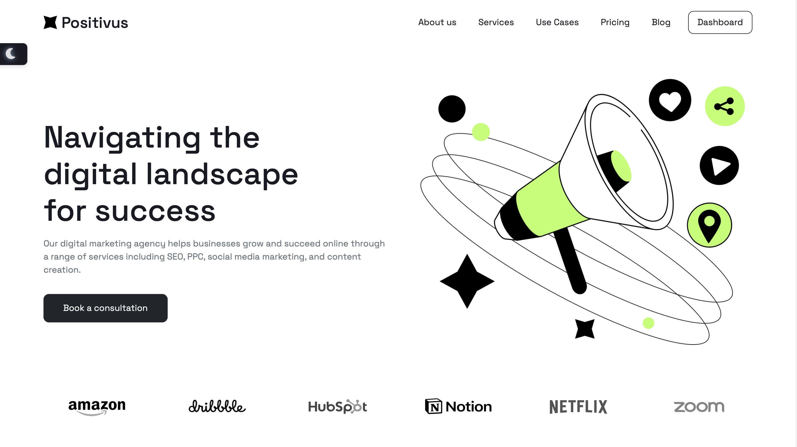
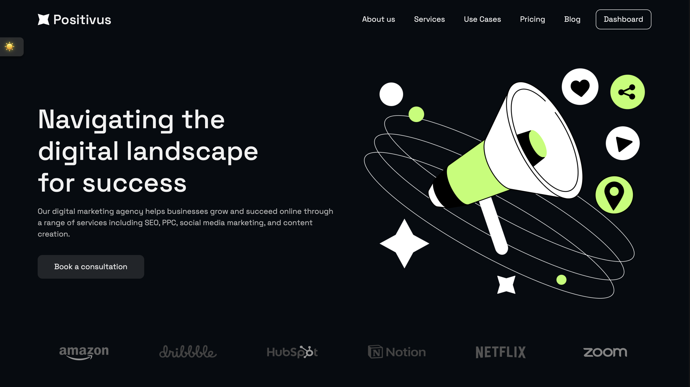

#  Positivus | Digital Advertising Agency & CMS Dashboard

> **Live Demo:** [https://positivus-cms.vercel.app]

Positivus is a dual-interface web application featuring a modern, conversion-optimized public landing page for a digital advertising agency, paired with a custom-built administrative dashboard. Engineered using React and Bootstrap, this project demonstrates the ability to bridge public-facing UI design with complex, state-driven internal content management tools.

---

## 🍽️ The Vision & Interface Design
**The Vision:** 
The core objective behind Positivus was to solve a common digital agency bottleneck: allowing marketing teams to update complex, highly styled website components without needing a frontend developer for every minor change. This project bridges the gap between a premium, conversion-optimized public website and an intuitive, foolproof internal content management tool.

**The Interface Ecosystem:**
* **Public-Facing Aesthetic:** A bold, modern, and highly accessible design language. It features high-contrast typography, engaging accordion layouts for the agency's working process, and unique, color-coordinated service cards designed to immediately grab user attention and drive engagement.
* **Administrative UX:** The CMS dashboard was engineered with a strict focus on operational clarity and safety. It utilizes a sleek dark-mode navigation sidebar, crisp modal overlays, and an interactive layout that prioritizes immediate visual feedback, ensuring administrators always feel in total control of the design changes before they go live.

## ✨ Core Features & Functionality

### 1. Dynamic Public Landing Page
The client-facing interface is a highly polished, responsive single-page layout designed to drive agency conversions.
* **Component-Driven Sections:** Features modular UI blocks including a step-by-step "Our Working Process" accordion, a dedicated Team directory, and a Case Studies showcase.
* **Dynamic Service Grid:** The services section renders visually distinct, highly customized cards based on data managed in the admin dashboard.

### 2. Custom CMS & Admin Dashboard
A secure backend interface allowing site administrators to manage the platform's core offerings without touching the codebase.
* **Service Management:** A "Manage Services" grid interface where administrators can view all active services, complete with a breakdown of the specific hex color codes assigned to each card.
* **Full CRUD Capabilities:** Dedicated actions to easily add, edit, or delete service cards directly from the UI.

### 3. Real-Time "Live Preview" Engine
The standout engineering feature of the dashboard is the interactive form state management.
* When adding or editing a service, users input data into a highly detailed modal, specifying text, imagery, and exact hex codes for backgrounds, titles, text, links, and action arrows.
* A "Live Preview" component instantly renders the exact UI of the card dynamically as the user types or alters colors, providing immediate visual feedback before the database is updated.

## 🛠️ Technical Architecture
* **Framework:** React (Bootstrapped via Create React App)
* **Styling & Layout:** Bootstrap integrated with custom CSS for highly specific component designs (like the dynamic service cards).
* **State Management:** Advanced React state handling to sync form inputs instantly with the live preview rendering engine.

## 🧠 Engineering Highlights
* **Dynamic Inline Styling:** Successfully mapped user-defined hex codes from form state directly to component style props to generate unique, color-coordinated UI cards on the fly.
* **Complex Form Handling:** Built robust, multi-input modals that handle both text data and media uploads seamlessly within the dashboard ecosystem.

---
*Developed by [Emad Wagih] — Frontend Web Developer*